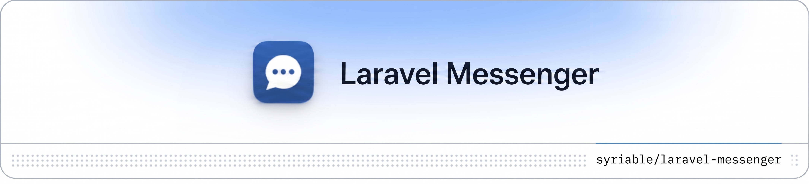

<p align="center">
    
</p>

# Laravel Messenger

[](https://packagist.org/packages/syriable/laravel-messenger)
[](https://github.com/syriable/laravel-messenger/actions/workflows/run-tests.yml)
[](https://packagist.org/packages/syriable/laravel-messenger)

A **headless, backend-only** one-to-one messaging domain platform for Laravel. Think Facebook Messenger / Instagram DMs / WhatsApp direct messages — not support tickets, channels or forums.

It is **Laravel-native, event-driven, performance-oriented and extensible by composition**. It ships **no UI, controllers, routes, policies or assets** — your application owns presentation and authorization; the package owns the messaging domain.

## Features

- 💬 **One-to-one conversations** — exactly one persistent conversation between any two participants, created lazily on the first message.
- 👤 **Morphable participants** — users, admins, sellers, support agents… any Eloquent model.
- 📎 **Attachments** — first-class upload lifecycle, storage, validation and metadata (images, PDFs, zips). No external media packages.
- ↩️ **Lightweight replies** — WhatsApp-style message references, never threads.
- 📥 **Inbox & unread tracking** — denormalized counters and activity ordering for fast, N+1-free reads.
- 🗂️ **Per-participant state** — archive, star, block, spam, clear — all participant-specific; the conversation stays neutral.
- 🧹 **Clear without deleting** — a visibility reset; history reappears when a new message arrives.
- 🛡️ **Block / spam** — mutual: while in place neither side can send, history is preserved.
- 🚩 **Message reporting** — report specific messages.
- 📡 **Optional realtime** — event-driven broadcasting (Reverb / Pusher / Echo). Works fully without it.
- 🧩 **Composable send pipeline** — plug in your own validation, filtering and moderation.

## Installation

```bash
composer require syriable/laravel-messenger
```

Publishing the migrations is **required** — the package ships them as
customisable stubs and does not run them automatically. Publish, then migrate:

```bash
php artisan vendor:publish --tag="messenger-migrations"
php artisan migrate
```

Optionally publish the config file:

```bash
php artisan vendor:publish --tag="messenger-config"
```

> The migrations use microsecond-precision timestamps (`timestamp(6)`) so the
> clear/visibility boundary stays correct when events share a wall-clock second.
> If you publish a fresh copy over an older install, re-check those columns.

## Setup

Add the `Messageable` trait and `MessengerParticipant` contract to any model that can take part in a conversation:

```php
use Illuminate\Database\Eloquent\Model;
use Syriable\Messenger\Contracts\MessengerParticipant;
use Syriable\Messenger\Support\Messageable;

class User extends Model implements MessengerParticipant
{
    use Messageable;
}
```

Participants are morphable, so different model types can message each other (e.g. a `Buyer` and a `SupportAgent`).

### Register a morph map (recommended for production)

Participant identity is stored as the model's `getMorphClass()` — by default the
fully-qualified class name (`App\Models\User`). If you later rename or move that
class, every stored `participant_type` becomes stale and the participant's
conversations silently disappear from their inbox. Register a **morph map**
before you run the first migration so the database stores a stable alias instead
of the raw class name:

```php
// AppServiceProvider::boot() — register BEFORE the first `php artisan migrate`
use Illuminate\Database\Eloquent\Relations\Relation;

Relation::enforceMorphMap([
    'user' => \App\Models\User::class,
    'agent' => \App\Models\SupportAgent::class,
]);
```

With the map in place, `participant_type` stores `'user'` instead of
`'App\Models\User'`, making your data portable across class renames. If you adopt
a morph map on an **existing** install, migrate the stored `participant_type`
(and `sender_type`) values to the new aliases in the same deployment.

## Usage

### Sending messages

A conversation is created automatically on the first message — conversations are never empty.

```php
use Syriable\Messenger\Facades\Messenger;

// Body only
$message = Messenger::send($alice, $bob, 'Hey Bob!');

// Via the participant model
$alice->sendMessageTo($bob, 'Hey Bob!');

// Attachments only, or body + attachments + a reply reference
$alice->sendMessageTo($bob, [
    'body' => 'Here is the file',
    'attachments' => [$request->file('document')],
    'reply_to' => $previousMessage, // or a message id
]);
```

A valid message must contain a **body, at least one attachment, or both**.

A `reply_to` reference must point to an existing message **in the same conversation that is still visible to the sender** (i.e. created after the sender's clear timestamp). A reply on a brand-new conversation, to a message from another conversation, or to a message the sender has cleared is rejected with `InvalidReplyException`. Empty (zero-byte) and over-limit attachments are rejected by the send pipeline; oversized original filenames are truncated to fit storage.

### Reading the inbox & messages

```php
// Inbox, ordered by latest activity (unread never reorders it)
$conversations = $alice->inbox();
$conversations = $alice->inbox(['include_archived' => true, 'starred' => true, 'limit' => 25]);

// Eager-load the participant models (e.g. Users) behind each conversation in a
// single grouped query, so rendering names/avatars is N+1-free (see below).
$conversations = $alice->inbox(['with_participant_models' => true]);

// Blocked/spam threads stay in the inbox by design (history is preserved); drop
// them explicitly if your UI hides them.
$conversations = $alice->inbox(['exclude_blocked' => true, 'exclude_spam' => true]);

// Messages, chronological (newest at the bottom), respecting the viewer's cleared history
// ⚠ between() is intentionally UNSCOPED: it resolves the conversation for any
// caller who knows the participant pair and does NOT enforce membership (unlike
// messages()/archive()/block()/… which throw InvalidParticipantException). If
// you derive the pair from request input, verify the current actor is one of the
// two participants before exposing the result. See "Authorization" below.
$conversation = Messenger::between($alice, $bob);
$messages = Messenger::messages($conversation, $alice, ['limit' => 50]);

// Keyset pagination for large conversations (mutually exclusive cursors):
// load the most recent page on open, then the previous page as the user scrolls up.
$latest = Messenger::messages($conversation, $alice, ['limit' => 50]);
$older  = Messenger::messages($conversation, $alice, ['before_id' => $latest->first()->id, 'limit' => 50]);
$newer  = Messenger::messages($conversation, $alice, ['after_id' => $latest->last()->id, 'limit' => 50]);

// ⚠ Always pass `limit`. Omitting it loads the **entire** visible history into memory.
// That is intentional for scripts, but almost never right for HTTP or Livewire endpoints.

// Unread totals (denormalized — no message scanning; archived excluded by default)
$alice->unreadMessagesCount();               // total unread messages
$alice->unreadConversationsCount();          // number of conversations with unread
Messenger::unreadCount($alice);              // total unread messages
Messenger::unreadConversations($alice);      // number of conversations with unread
Messenger::unreadCount($alice, includeArchived: true); // include archived threads
// Note: unread totals include blocked and spam threads by default, consistent with
// inbox defaults. If your UI hides blocked/spam, filter them in the UI badge too.
```

Cursors are **keyset** (not offset) and exclude the cursor message itself, so
they stay correct as new messages arrive and never re-scan skipped rows. The
result is always returned in chronological order regardless of direction, and a
cursor that does not belong to the conversation throws `InvalidArgumentException`.

> **Inbox N+1.** `inbox()` is N+1-free for the package's own relations, but it
> does **not** load the polymorphic model behind each participant unless you ask
> it to. If you render participant names or avatars, pass
> `['with_participant_models' => true]` so the Users are loaded in one grouped
> query — otherwise resolving `otherParticipantFor($alice)->participant` lazily
> issues one query per conversation.

### Conversation state (per participant)

```php
Messenger::archive($conversation, $alice);     // and ->unarchive(...)
Messenger::star($conversation, $alice);        // and ->unstar(...)
Messenger::block($conversation, $alice);       // mutual; ->unblock(...)
Messenger::spam($conversation, $alice);        // mutual; ->unspam(...)
Messenger::clear($conversation, $alice);       // visibility reset, no deletion
Messenger::markAsRead($conversation, $alice);  // opening a conversation reads it
Messenger::markAsUnread($conversation, $alice);// sets unread_count to 1 (not the true historical count)
```

### Reporting a message

```php
Messenger::report($message, $reporter, reason: 'spam', note: 'Unsolicited link');
```

## Handling domain exceptions in the host application

The package is **headless**: when a messaging rule is violated it throws a typed
**domain exception** and never converts it to an HTTP response, a
`ValidationException`, or a flash message. Translating these into your UI/API is
the host application's job. Every package exception extends a single base class,
**`Syriable\Messenger\Exceptions\MessengerException`** (which extends
`RuntimeException`), so you can catch them all in one place or handle subclasses
individually.

| Exception | Thrown when | Suggested mapping |
| --- | --- | --- |
| `ConversationBlockedException` | Sending into a conversation either side has blocked or marked as spam | 403 / inline notice |
| `InvalidMessageException` | The message has no body and no attachments, or the body exceeds `max_body_length` | 422 |
| `InvalidAttachmentException` | An attachment is empty, too large, over the per-message count, or a disallowed type/mime | 422 |
| `InvalidReplyException` | `reply_to` points outside the conversation or to a message the sender has cleared | 422 |
| `InvalidParticipantException` | The actor is not a member of the conversation, or a participant does not exist (with the optional existence guard) | 403 / 404 |
| `InvalidReportException` | A report's reason/note exceeds its limit, or (with the optional guard) the reporter is not a participant | 422 |

```php
use Syriable\Messenger\Exceptions\MessengerException;

try {
    Messenger::send($from, $to, $payload);
} catch (MessengerException $e) {
    // Catches every package exception above. Catch specific subclasses first
    // if you want different status codes or messages per failure.
    return redirect()
        ->route('conversations.show', $conversation)
        ->withErrors(['message' => $e->getMessage()]);
}
```

> **Prefer an explicit redirect target over `back()`.** `back()` relies on the
> `Referer` header; API clients, Inertia/Livewire flows that strip it, and direct
> POSTs fall back to `/`, silently dropping the error flash. Redirect to a named
> route (the conversation view) so the error is always rendered. The same mapping
> applies in API controllers (return a JSON error) and Livewire/Inertia layers.

> **Duplicate submissions are a host responsibility.** The package has no
> idempotency guard by design — calling `send()` twice with the same body stores
> two messages. Prevent double-submits in your UI (disable the button on submit,
> debounce, or carry a request id you de-duplicate on) just as you would for any
> form POST.

## Events

Every lifecycle operation dispatches an immutable, past-tense domain event you can listen to:

`MessageSent`, `ConversationCreated`, `ConversationArchived` / `ConversationUnarchived`, `ConversationStarred` / `ConversationUnstarred`, `ConversationBlocked` / `ConversationUnblocked`, `ConversationMarkedAsSpam` / `ConversationUnmarkedAsSpam`, `ConversationCleared`, `ConversationRead`, `ConversationMarkedAsUnread`, `MessageReported`.

## Realtime broadcasting

Broadcasting is optional and **event-driven** — it is never coupled into the actions. It is **disabled by default**; turn it on by setting `MESSENGER_BROADCASTING_ENABLED=true`. The published configuration defaults:

```php
// config/messenger.php
'broadcasting' => [
    'enabled' => env('MESSENGER_BROADCASTING_ENABLED', false),
    'channel_prefix' => 'messenger',
    'private' => true,
],
```

When enabled, a `MessageSentBroadcast` is broadcast on `messenger.conversation.{id}` (as `message.sent`). Listen with Laravel Echo:

```js
Echo.private(`messenger.conversation.${conversationId}`)
    .listen('.message.sent', (e) => console.log(e));
```

Private channels require a channel authorization callback in your host application. Without one, Echo subscriptions to private channels will fail with a 403:

```php
// routes/channels.php (host application)
use Syriable\Messenger\Models\Conversation;

Broadcast::channel('messenger.conversation.{conversationId}', function ($user, string $conversationId) {
    $conversation = Conversation::find($conversationId);

    return $conversation
        && $conversation->participants()
            ->where('participant_type', $user->getMorphClass())
            ->where('participant_id', $user->getKey())
            ->exists();
});
```

> If you set `private => false` in the config, messages broadcast on a public channel with no access control — anyone who knows a conversation ID can subscribe. Only use this in trusted internal environments.

The broadcast is a lightweight notification. It carries the message's core fields plus a metadata-only attachment summary — `has_attachments` and an `attachments` array of `{ id, name, mime_type, size }` — so clients can render attachment-only or mixed messages without a follow-up request. It intentionally does **not** include file contents or URLs (those are disk/authorization concerns); load the message (e.g. `Messenger::messages()`) or override `broadcastWith()` if you need more.

## Customizing the send pipeline

Messages pass through a composable, configurable pipeline before they are stored. Add your own moderation / filtering pipes:

```php
// config/messenger.php
'pipeline' => [
    \Syriable\Messenger\Pipelines\Send\EnsureParticipantsAreValid::class,
    \Syriable\Messenger\Pipelines\Send\EnsureParticipantsExist::class,
    \Syriable\Messenger\Pipelines\Send\EnsureConversationIsNotBlocked::class,
    \Syriable\Messenger\Pipelines\Send\EnsureMessageHasContent::class,
    \Syriable\Messenger\Pipelines\Send\EnsureAttachmentsAreValid::class,
    \Syriable\Messenger\Pipelines\Send\EnsureReplyIsValid::class,
    \App\Messaging\ProfanityFilter::class, // your own SendPipe
],
```

A pipe implements `Syriable\Messenger\Contracts\SendPipe`:

```php
use Closure;
use Syriable\Messenger\Contracts\SendPipe;
use Syriable\Messenger\Data\PendingMessage;

class ProfanityFilter implements SendPipe
{
    public function handle(PendingMessage $message, Closure $next): PendingMessage
    {
        // inspect / mutate / reject, then:
        return $next($message);
    }
}
```

> The default pipes provide the package's core guarantees (valid participants, mutual block/spam, non-empty messages, attachment limits, valid replies). The pipeline is yours to customise, but **removing a default pipe removes the guarantee it provides** — e.g. dropping `EnsureMessageHasContent` lets empty messages persist. Add pipes freely; only remove a default one when you intend to drop its check. Note that `EnsureAttachmentsAreValid` validates client-reported type/size/count metadata only — add your own pipe for deep content inspection or virus scanning of untrusted uploads. See [`docs/ARCHITECTURE.md`](docs/ARCHITECTURE.md#design-constraints--trade-offs-v1).

## Authorization

The package is **not** responsible for business authorization (no policies, roles or ACL). Your application decides who may message whom. The package only enforces internal messaging constraints: blocked / spam conversations, participant membership and message validity.

**Reads require participation.** Conversation-scoped operations enforce membership: `Messenger::messages($conversation, $viewer)` (and the participant-state actions `archive`, `clear`, `block`, `markAsRead`, …) throw `InvalidParticipantException` when the viewer is not a participant — they do **not** return an empty result. Catch it and map to 403/404.

**`between()` is the deliberate exception — it is unscoped.** `Messenger::between($a, $b)` is a pure key lookup that resolves the conversation for *any* caller who knows the participant pair; it performs **no** membership check (it is the building block the send path and your authorization layer compose on top of). Because every other conversation entry point gates access, do not treat a `between()` result as access-controlled: if the pair comes from request input, confirm the current actor is one of the two participants before rendering or acting on it.

Consistent with this, **message reporting is unrestricted by default**: `Messenger::report()` accepts a report from any identity against any message and does not require the reporter to be a participant. Set `messenger.reports.participants_only` to `true` to require the reporter to belong to the message's conversation, or gate it in your application.

Two further opt-in guards are available (both **off by default** to preserve the headless contract):

- `messenger.validation.verify_participants_exist` — when `true`, the send pipeline rejects a sender/recipient that does not exist in the database (preventing "ghost" participants).
- `messenger.reports.participants_only` — participant-only reporting, as above.

## Security notes

Because the package is headless and host-owned, a few responsibilities sit with your application:

- **Attachment access.** `$attachment->url` returns `Storage::disk($disk)->url($path)` with no signing or authorization. If you store attachments on a **public** disk, those URLs are world-readable. Use a private disk and serve files through an authorized controller (or `temporaryUrl()` on a disk that supports it). The package never gates file access for you.
- **Mass assignment.** Package models use `$guarded = []` and are intended to be written **only** through the package's actions (`Messenger::send()`, `report()`, etc.), never filled directly from request input. Do not do `Message::create($request->all())` or `$participant->update($request->all())` — that would let callers tamper with fields like `unread_count`, `blocked_at` or `sender_id`. Treat the models as internal domain objects.
- **Blocked / spam conversations stay in the inbox.** Blocking or marking spam prevents *sending* (mutually) but, per the v1 spec, keeps history visible and stored — so these conversations still appear in `Messenger::inbox()`. Each returned `Conversation` exposes the participant's `blocked_at` / `spammed_at` state for your UI to badge, or pass `['exclude_blocked' => true, 'exclude_spam' => true]` to drop them from the result entirely.
- **Deleting participants is host-owned.** The morphable design precludes database foreign keys, so deleting a host participant model does not cascade: their `messenger_participants`, messages, attachments and reports remain, and `morphTo` accessors like `$message->sender` then resolve to `null`. Treat those relations as nullable in your UI. When you delete an account, also remove its messenger rows.

## Pruning attachment files

Messages are immutable and the package never hard-deletes, so when you delete messages/conversations yourself the underlying attachment files stay on disk. Reclaim them with the bundled command, which removes files under the configured attachments directory that no longer have a matching database row:

```bash
php artisan messenger:prune                 # delete orphaned attachment files
php artisan messenger:prune --dry-run       # list them without deleting
php artisan messenger:prune --disk=s3       # scan a specific disk
```

Or programmatically (returns the orphaned paths):

```php
Messenger::pruneAttachments();              // delete and return
Messenger::pruneAttachments(dryRun: true);  // list only
```

Pruning is explicit and opt-in — it never runs automatically — so it is safe against the immutability model.

## Database & concurrency

The send path is built for parallel writes: the lazy first-message race recovers
by attaching to the winning conversation, block/spam is re-checked under a row
lock inside the transaction, the unread counter increments atomically in SQL, and
the write transaction is **retried a bounded number of times on transient
concurrency errors** (deadlock, lock-wait timeout, SQLite `database is locked`).
The suite runs on SQLite, **MySQL 8 and PostgreSQL 16** in CI.

SQLite serialises all writers, so under heavy parallel write load it can still
raise `database is locked` faster than the retries absorb. For production with
meaningful concurrency, use **MySQL or PostgreSQL**. If you do run SQLite, enable
WAL and a busy timeout so the driver waits for the lock instead of failing
immediately:

```php
// config/database.php — sqlite connection
'options' => [PDO::ATTR_TIMEOUT => 5], // seconds to wait on a locked database
// and run once: PRAGMA journal_mode=WAL;
```

## Architecture

See [`docs/ARCHITECTURE.md`](docs/ARCHITECTURE.md) for the full design: thin models, single-responsibility actions, read-only queries, DTOs, the send pipeline, domain events and the performance / denormalization strategy.

## Testing

```bash
composer test
```

## License

The MIT License (MIT). Please see [License File](LICENSE.md) for more information.
